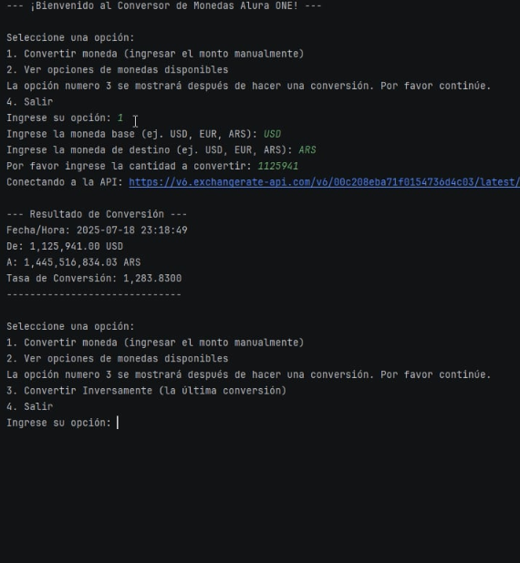

<h1 align="center">
    💰 Conversor de Monedas Dinámico 💱
</h1>

<p align="center">
    
</p>

<p align="center">
    Un proyecto interactivo de conversión de monedas en tiempo real desarrollado en Java.
</p>

<p align="center">
    
    
    
</p>

## 📖 Índice

* [Descripción del Proyecto](#-descripción-del-proyecto)
* [Estado del Proyecto](#-estado-del-proyecto)
* [Características y Demostración](#-características-y-demostración)
* [Acceso y Ejecución del Proyecto](#-acceso-y-ejecución-del-proyecto)
* [Tecnologías Utilizadas](#-tecnologías-utilizadas)
* [Desarrollador Principal](#-desarrollador-principal)
* [Licencia](#-licencia)

---

## 🚀 Descripción del Proyecto

El <strong>Conversor de Monedas Dinámico</strong> es una aplicación de consola desarrollada en Java que permite a los usuarios realizar conversiones de divisas en tiempo real. Este proyecto integra una API externa para obtener tasas de cambio actualizadas, ofreciendo una solución práctica y precisa para las necesidades de conversión monetaria diaria.

Fue creado como parte del «Challenge One: Oracle Next Education - Java Backend», enfocándose en la implementación de buenas prácticas de programación, manejo de APIs RESTful y mejora continua de la experiencia del usuario.

## 🚧 Estado del Proyecto

<h4 align="center">
:construction: Proyecto en desarrollo activo y mejoramiento continuo :construction:
</h4>

## ✨ Características y Demostración

La aplicación ofrece las siguientes funcionalidades clave para una experiencia de usuario fluida:

-   **Conversión en Tiempo Real**: Permite convertir entre diversas divisas utilizando tasas de cambio obtenidas al instante de una API externa confiable.
-   **Entrada Interactiva y Validada**: Los usuarios pueden especificar la moneda base, la moneda de destino y la cantidad a convertir. El sistema implementa validaciones robustas que aseguran la entrada de formatos correctos (ej. códigos de 3 letras para monedas, valores numéricos para cantidades), solicitando correcciones en el mismo paso y sin interrumpir el flujo de conversión.
-   **Conversión Inversa**: Ofrece la conveniencia de realizar una conversión inversa de la última operación exitosa con una sola opción de menú.
-   **Historial de Conversiones**: Mantiene un registro de todas las conversiones realizadas durante la sesión.
-   **Formato de Salida Claro**: Los resultados se muestran con un formato numérico legible, utilizando comas como separador de miles y puntos como separador decimal (ej. 12,345.67) para una mejor comprensión.

---

### Demostración Visual    
<p align="center">
    Puedes ver una demostración en video del conversor de monedas aquí:
    <br><br>
    <a href="https://vimeo.com/1102717817?share=copy" target="_blank">
        
    </a>
    <br>
    <em>Haz clic en la imagen para ver la demostración completa de la aplicación en video (se abrirá en una nueva pestaña).</em>
</p>

## 📦 Acceso y Ejecución del Proyecto

Para descargar, configurar y ejecutar este Conversor de Monedas en tu entorno local, sigue los siguientes pasos:

1.  **Clonar el Repositorio:**
    Abre tu terminal o Git Bash y ejecuta:
    ```bash
    git clone https://github.com/Jess-93/currency-converter-AlluraXOneChallenge.git
    ```
2.  **Navegar al Directorio del Proyecto:**
    ```bash
    cd currency-converter-AlluraXOneChallenge
    ```
3.  **Configurar tu Clave API:**
    * Este proyecto utiliza la [ExchangeRate-API](https://www.exchangerate-api.com/) para obtener las tasas de cambio. Regístrate en su sitio web para obtener tu clave API gratuita.
    * Abre el archivo `src/Main/com/allura/currencyconverter/CurrencyConverterApp.java` en tu IDE o editor de texto.
    * Localiza la línea:
        ```java
        private static final String API_KEY = "TU_API_KEY_AQUI";
        ```
    * Reemplaza `"TU_API_KEY_AQUI"` con tu clave API real.
4.  **Compilar y Ejecutar (con Maven):**
    * Asegúrate de tener **Maven** instalado en tu sistema.
    * Desde el directorio raíz del proyecto en tu terminal, ejecuta el siguiente comando para compilar y ejecutar la aplicación:
        ```bash
        mvn clean install exec:java -Dexec.mainClass="com.allura.currencyconverter.CurrencyConverterApp"
        ```
    * Alternativamente, puedes importar el proyecto a tu IDE preferido (IntelliJ IDEA, Eclipse, VS Code) y ejecutar la clase `CurrencyConverterApp` directamente desde su método `main`.

## ⚙️ Tecnologías Utilizadas

Este proyecto ha sido construido utilizando las siguientes tecnologías y herramientas:

* **Java 17+**: Lenguaje de programación robusto y versátil.
* **Maven**: Herramienta indispensable para la gestión de dependencias y la construcción automatizada del proyecto.
* **Gson (Google)**: Biblioteca para la serialización y deserialización de objetos Java a/desde JSON, facilitando la interacción con la API.
* **ExchangeRate-API**: Servicio RESTful externo que proporciona tasas de cambio de divisas en tiempo real.
* **Git & GitHub**: Utilizados para el control de versiones, la colaboración y el alojamiento del código fuente.

## 👨‍💻 Desarrollador Principal

| [<br><sub>Jesús Villarreal</sub>](https://github.com/Jess-93) |
| :---: |

## 📄 Licencia

Este proyecto está bajo la Licencia MIT. Esto significa que es de código abierto y puedes usarlo, modificarlo y distribuirlo libremente. 

---
<p align="center">
  ¡Mis mejores deseos para todos ustedes! Muchas gracias a ONE y Alura por esta oportunidad de aprendizaje y desarrollo. 
</p>
